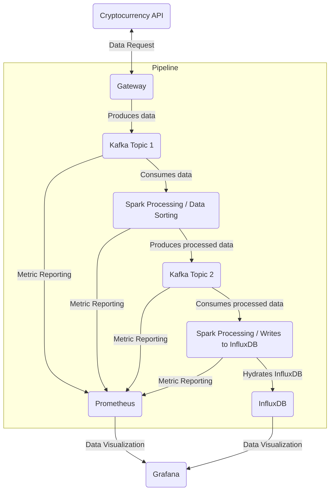

# Crypto Viz: Real-Time Cryptocurrency Monitoring Tool

### Introduction

Automated system for collecting and analyzing cryptocurrency data with dynamic visualizations.

### Fonctionnalités

- Gateway: Continuously scrapes data on certain cryptocurrencies.
- Analysis Builder: Processes the retrieved data to extract information.
- Dynamic Visualizer: Provides dynamic visualizations of the analyses.

### Schéma



### Running the Program

Steps to run the program

1 - Execute this command to allow Docker to launch the Kafka topics creation script:
```shell
chmod +x create-topics.sh
```
then this one:
```shell
chmod +x ./spark-scripts/start.sh
```
and this one:
```shell
chmod +x ./spark-scripts/entrypoint.sh
```

2 - Execute the Docker compose with this command:
```shell
docker-compose up
```

3 - Start the Python scraper:
```shell
python3 /cryptocurrency-scraping/main.py
```

4 - Read what Spark writes in "topic2" (optional):
```shell
kafka-console-consumer --bootstrap-server localhost:9093 --topic topic2 --from-beginning
```

5 - Visualize the data in Grafana:

- Go to http://localhost:3000
- Log in with the credentials: admin / admin
- Enter a new admin password
- In the toggle menu, click on "Dashboard" then "Cryptocurrency"
- Some useful commands:

Enter the Spark Worker container:
```shell
docker-compose exec spark-worker /bin/bash
```

- Launch the Spark job for data processing:
```shell
spark-submit --packages org.apache.spark:spark-sql-kafka-0-10_2.12:3.1.2 /opt/spark-scripts/cryptocurrency-treatment.py
```

- Launch the Spark job for writing to InfluxDB:
```shell
spark-submit --packages org.apache.spark:spark-sql-kafka-0-10_2.12:3.1.2 /opt/spark-scripts/influxdb-writer.py     
```